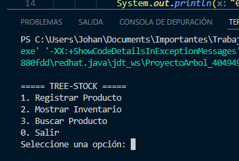
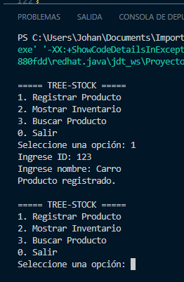
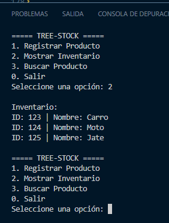
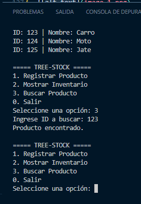

# ProyectoArbol — Sistema de Inventario con Árbol Binario de Búsqueda

## Objetivo

Que el estudiante comprenda el concepto de árbol binario de búsqueda (BST) y su estructura lógica, siendo capaz de aplicarlo en un sistema de clasificación o inventario implementado en Java.  
Esta actividad evalúa la capacidad de trabajar con estructuras dinámicas, aplicar recursividad, trabajo en equipo y uso de GitHub.

---

## Descripción del sistema

**ProyectoArbol** es una aplicación de consola que permite gestionar un inventario de productos utilizando un árbol binario de búsqueda.

Los productos se organizan automáticamente por su ID, lo que permite:

- Insertar productos de forma ordenada
- Buscar productos rápidamente
- Mostrar el inventario en orden ascendente

---

## Estructura del proyecto

El sistema está dividido en tres clases:

### Producto.java (Nodo)
- Atributos:
  - `int id`
  - `String nombre`
- Referencias:
  - `Producto izquierdo`
  - `Producto derecho`

---

### ArbolInventario.java (Lógica)
Contiene los métodos principales:

- `insertar()` → Inserción recursiva
- `inorden()` → Recorrido ordenado
- `buscar()` → Búsqueda por ID

---

### Main.java (Interfaz)
Incluye un menú interactivo con:

1. Registrar Producto  
2. Mostrar Inventario  
3. Buscar Producto  
0. Salir  

---

## Instrucciones de ejecución

1. Abrir el proyecto en Visual Studio Code
2. Tener instalado JDK (Eclipse Temurin recomendado)
3. Abrir la terminal en la carpeta del proyecto
4. Ejecutar:    java Main

---

## Ejemplo de uso

### Menú principal

===== TREE-STOCK =====

Registrar Producto
Mostrar Inventario
Buscar Producto
Salir

---

### Registro de producto

Ingrese ID: 123
Ingrese nombre: Carro
Producto registrado.

---

### Inventario ordenado

ID: 123 | Nombre: carro
ID: 124 | Nombre: Moto
ID: 125 | Nombre: jate

---

### Búsqueda

Ingrese ID a buscar: 123
Producto encontrado.

---

## Explicación del árbol

- Cada producto es un nodo del árbol
- Si el ID es menor → va a la izquierda
- Si el ID es mayor → va a la derecha
- Se usa recursividad para insertar y buscar
- El recorrido inorden muestra los datos ordenados automáticamente

---

## Evidencias

Capturas de pantalla de:

- Menú en ejecución  

- Inserción de productos  

- Inventario mostrado  

- Búsqueda de producto 

---

## Repositorio

Enlace: https://github.com/BristhynGP/ProyectoArbol.git

## Video

Enlace: https://youtu.be/MJY5tecCZuw